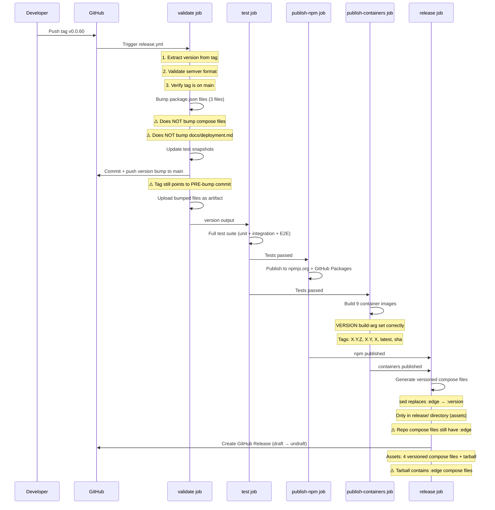

# Version Reference Audit — Issue #2523

Part of Epic #2522: Correctly update compose files and docs in tagged version releases.

## Summary

This audit catalogs every file in the repository that contains version references, image tags, or version-dependent content. It establishes ground truth for what the release workflow must update and what it must leave alone.

**Current release version**: `0.0.60`
**Current image tag on main**: `:edge`

---

## 1. Complete Inventory of `:edge` Image References

### Production Compose Files (MUST update at release)

| File | Line(s) | Images Referenced |
|------|---------|-------------------|
| `docker-compose.yml` | 22, 114, 139, 267, 339, 427, 496, 590, 640 | db, migrate, api, worker, symphony-worker, tmux-worker, ha-connector, app, prompt-guard (9 images) |
| `docker-compose.traefik.yml` | 262, 355, 380, 531, 642, 752, 806 | db, migrate, api, worker, tmux-worker, app, prompt-guard (7 images) |
| `docker-compose.quickstart.yml` | 42, 93, 112, 216, 262 | db, migrate, api, worker, prompt-guard (5 images) |
| `docker-compose.full.yml` | 239, 321, 345, 475, 550, 602, 655, 736, 933 | db, migrate, api, worker, symphony-worker, ha-connector, app, tmux-worker, prompt-guard (9 images) |

**Total**: 30 `:edge` references across 4 files.

### Release Workflow (References `:edge` in sed replacement — correct behavior)

| File | Line(s) | Context |
|------|---------|---------|
| `.github/workflows/release.yml` | 720-721 | `sed` command replaces `:edge` with release version for GitHub Release assets |

---

## 2. Complete Inventory of `:latest` Image References

### Documentation (MUST update at release)

| File | Line(s) | Images Referenced |
|------|---------|-------------------|
| `docs/deployment.md` | 113-116 | db, api, app, migrate — all use `:latest` instead of versioned tags |

### Build/CI Scripts (Should NOT update — local build tags)

| File | Line(s) | Context |
|------|---------|---------|
| `.github/workflows/integration.yml` | 79-86 | Local `docker build -t ...:latest` for integration tests (8 images) |
| `scripts/integration-test.sh` | 143-147 | Local `docker build -t ...:latest` for local testing (5 images) |

### Other Documentation (Informational — no action needed)

| File | Line(s) | Context |
|------|---------|---------|
| `docs/deployment.md` | 726 | `traefik/whoami:latest` — third-party image, not ours |
| `docs/deployment.md` | 1231-1235 | Example using `v1.2.3` tags — illustrative, not functional |
| `docs/plans/2026-02-28-services-default-implementation.md` | 106 | Historical plan doc referencing `:latest` |
| `docker-compose.full.yml` | 858 | `ghcr.io/phioranex/openclaw-docker:latest` — third-party OpenClaw image |
| `docker/traefik/examples/docker-compose.override.example.yml` | 47, 75 | Third-party images (traefik/whoami, grafana) |

---

## 3. Version Numbers in Package Files (MUST track release version)

| File | Current Version | Updated By Release Workflow |
|------|-----------------|-----------------------------|
| `package.json` | `0.0.60` | Yes — `validate` job, line 123-142 |
| `packages/openclaw-plugin/package.json` | `0.0.60` | Yes — `validate` job, line 123-142 |
| `packages/openclaw-plugin/openclaw.plugin.json` | `0.0.60` | Yes — `validate` job, line 123-142 |
| `pnpm-lock.yaml` | Derived | Yes — `pnpm install --lockfile-only` after bump |
| `packages/openclaw-plugin/tests/__snapshots__/schema-snapshots.test.ts.snap` | Derived | Yes — snapshot update step |

---

## 4. Dockerfile VERSION Build Args

All Dockerfiles accept a `VERSION` build arg for OCI labels. These are populated at build time by the CI workflow and do NOT need file-level changes.

| Dockerfile | Build Arg | Label |
|------------|-----------|-------|
| `docker/api/Dockerfile` | `VERSION` (line 62) | `org.opencontainers.image.version` |
| `docker/app/Dockerfile` | `VERSION` (line 75) | `org.opencontainers.image.version` |
| `docker/worker/Dockerfile` | `VERSION` (line 52) | `org.opencontainers.image.version` |
| `docker/ha-connector/Dockerfile` | `VERSION` (line 52) | `org.opencontainers.image.version` |
| `docker/tmux-worker/Dockerfile` | `VERSION` (line 60) | `org.opencontainers.image.version` |
| `docker/symphony-worker/Dockerfile` | `VERSION` (line 53) | `org.opencontainers.image.version` |
| `docker/migrate/Dockerfile` | `VERSION` (line 11) | `org.opencontainers.image.version` |
| `docker/prompt-guard/Dockerfile` | `VERSION` + `OCI_VERSION` (lines 17, 20) | `org.opencontainers.image.version` |
| `docker/postgres/Dockerfile` | `OCI_VERSION` (line 13, default: `1.0.0`) | `org.opencontainers.image.version` |

**Note**: `docker/postgres/Dockerfile` uses a hardcoded default `OCI_VERSION="1.0.0"`. The release workflow overrides this via build-arg, but if the build-arg is missing, it falls back to `1.0.0`.

---

## 5. Categorized File List

### MUST Update at Release (compose file image tags)

These files contain `:edge` image tags that must be replaced with the release version when a tag is created:

1. `docker-compose.yml` — 9 image references
2. `docker-compose.traefik.yml` — 7 image references
3. `docker-compose.quickstart.yml` — 5 image references
4. `docker-compose.full.yml` — 9 image references

### MUST Update at Release (version numbers)

5. `package.json` — version field
6. `packages/openclaw-plugin/package.json` — version field
7. `packages/openclaw-plugin/openclaw.plugin.json` — version field

### SHOULD Update at Release (documentation)

8. `docs/deployment.md` (lines 113-116) — uses `:latest` tags, should reference versioned tags or explain how to pin

### Must NOT Update (development/test infrastructure)

9. `.devcontainer/docker-compose.devcontainer.yml` — uses `build:` context, no published images
10. `docker-compose.test.yml` — uses `build:` context, no published images
11. `.github/workflows/integration.yml` — local `docker build -t ...:latest` for CI tests
12. `scripts/integration-test.sh` — local `docker build -t ...:latest` for local tests

### No Action Needed (informational/third-party)

13. `.github/workflows/containers.yml` — generates `:edge` tags via docker/metadata-action (correct)
14. `.github/workflows/release.yml` — generates versioned tags via docker/metadata-action (correct)
15. `ops/README.md` — generic reference, no specific version
16. `docker/traefik/examples/` — third-party images only
17. `docs/plans/` — historical plan documents
18. `tests/` — test assertions about image naming patterns

---

## 6. Image Coverage Matrix

Not all images appear in all compose files. This matrix shows which images are in which files:

| Image Name | docker-compose.yml | traefik.yml | quickstart.yml | full.yml | Release Body |
|------------|:-:|:-:|:-:|:-:|:-:|
| db | Y | Y | Y | Y | Y |
| api | Y | Y | Y | Y | Y |
| app | Y | Y | - | Y | Y |
| migrate | Y | Y | Y | Y | Y |
| worker | Y | Y | Y | Y | Y |
| prompt-guard | Y | Y | Y | Y | Y |
| tmux-worker | Y | Y | - | Y | Y |
| ha-connector | Y | - | - | Y | Y |
| symphony-worker | Y | - | - | Y | **MISSING** |

**Finding**: `symphony-worker` is built and published by the release workflow (line 530-532) but is **missing from the release body** (lines 786-793). This was already identified in issue #2535.

---

## 7. Current Release Flow — Sequence Diagram

### Gaps Identified in Current Flow

1. **Compose files not bumped in repo**: The `validate` job bumps `package.json` files but does NOT update compose file image tags. A `git checkout v0.0.60` still shows `:edge` tags.

2. **Tag points to pre-bump commit**: The tag `v0.0.60` points to the commit _before_ the version bump. The bump commit is pushed to `main` after the tag is created.

3. **Documentation not updated**: `docs/deployment.md` always shows `:latest` regardless of version.

4. **Release tarball contains `:edge`**: The tarball asset is created from the repo checkout (which has `:edge`), not from the `release/` directory.

5. **Versioned compose files only in release assets**: The `sed`-generated versioned compose files exist only as GitHub Release assets, not in the git history.

6. **symphony-worker missing from release body**: The release notes table lists 8 images but symphony-worker is the 9th.

7. **No restore-to-edge step**: After a version bump, there is no step to restore compose files to `:edge` on main (because compose files are never bumped in the first place).

---

## 8. Test Script

A test script has been created at `scripts/check-version-consistency.sh` that:

- When `VERSION` is set: fails if any production compose file contains `:edge` references
- When `VERSION` is not set: validates all production compose files consistently use `:edge`
- Verifies excluded files (devcontainer, test) do not use published image tags
- Reports image coverage across all compose files

Current behavior on main (expected):
- Without `VERSION`: **PASSES** (all compose files use `:edge`)
- With `VERSION=0.0.60`: **FAILS** (compose files still have `:edge` — this is the bug)

This script will be integrated into CI verification per issue #2528.

---

## 9. Recommendations for Phase 2

Based on this audit, the release workflow needs to:

1. **Add compose file updates to `validate` job** (#2524): Apply `sed` replacement on all 4 production compose files before committing.
2. **Re-point tag to version bump commit** (#2525): Move the tag after the version bump commit so `git checkout v0.0.60` has correct versions.
3. **Restore `:edge` after version bump** (#2526): Add a follow-up commit that reverts compose files to `:edge` on main.
4. **Remove redundant compose generation** (#2527): The `release` job's `sed` step becomes unnecessary once compose files are bumped in the repo.
5. **Add CI verification** (#2528): Integrate `check-version-consistency.sh` into CI.
6. **Update docs/deployment.md** (#2531): Change `:latest` references to explain version pinning.
7. **Fix symphony-worker in release body** (#2535): Add the missing image to the release notes template.
